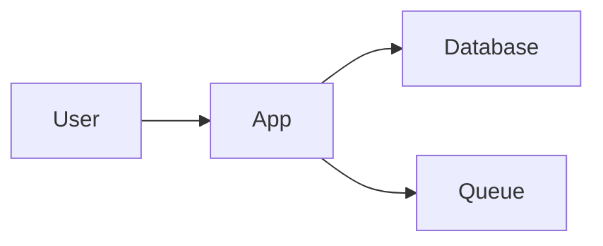

Some open-source projects feel like they were built to solve one extremely annoying, extremely common problem. Mermaid is one of those. It takes plain text and turns it into diagrams, which means you can create flowcharts, sequence diagrams, Gantt charts, ER diagrams, mind maps, and more without reaching for a separate design app.

That pitch alone is already pretty good. The part that makes Mermaid especially cool is that it treats diagrams like code. Your architecture sketch is no longer a screenshot that goes stale the second the system changes. It becomes text you can edit, diff, review, store in Git, and keep right next to the docs it explains. Tiny miracle, honestly.

## Quick tour

At its core, Mermaid is a JavaScript-based diagramming tool with a Markdown-ish syntax. You write something like this:

…and Mermaid renders it as an actual diagram.

That sounds simple, but it unlocks a lot. Instead of dragging boxes around at 11:48 PM while wondering why two arrows refuse to line up, you describe the structure in text and let the renderer do the fussy part. Mermaid supports more than 20 diagram types, so it can cover everything from “how requests move through this system” to “what even is this release process?”

A few standout features:

- **Text-first diagrams** that work beautifully with version control
- **Lots of diagram types**, including flowcharts, sequence diagrams, class diagrams, timelines, Git graphs, and Sankey diagrams
- **Live Editor** for quick experiments and instant previews
- **Native support in places developers already live**, including GitHub-flavored Markdown and many docs tools
- **Themes and configuration** so your diagrams do not all look like they came from the same beige cubicle

## Why it’s cool

Mermaid helps fix “doc rot,” which is the very real phenomenon where diagrams become historical fiction within a week. When diagrams are just text, updating them feels closer to editing a README than opening a design tool, nudging teams toward keeping them current.

It also lowers the barrier to making diagrams in the first place. If you can write a few lines of structured text, you can make something useful. That is great for engineers, but also for product folks, writers, students, and anyone who wants to explain a process without becoming a part-time vector artist.

And there is a neat side effect: diagrams become easier to review. A pull request that changes a workflow can also change the workflow diagram in the same diff. That is chef’s-kiss documentation hygiene.

## Who it’s for

Mermaid is especially good for:

- developers documenting systems or APIs
- teams writing architecture notes in Markdown
- open-source maintainers who want readable diagrams in repos
- teachers and students explaining processes or data flows
- anyone who has ever muttered “I swear the diagram was accurate when I made it”

If your work already lives in GitHub, GitLab, a wiki, or a docs site, Mermaid fits in nicely. It is not trying to replace every polished design tool on Earth, and that is fine. Its sweet spot is fast, practical, maintainable diagrams.

## Getting started

The smallest first step is to open the Mermaid Live Editor and paste in a tiny flowchart. No install, no setup, just type and see what happens.

If you want to try it inside Markdown on GitHub, create a code block labeled `mermaid` and add a few nodes and arrows. That is enough to get the “oh, this is handy” moment in under two minutes.

## Links

- Official docs: https://mermaid.ai/open-source/intro/getting-started.html
- GitHub repo: https://github.com/mermaid-js/mermaid
- Extra: https://github.blog/developer-skills/github/include-diagrams-markdown-files-mermaid/
